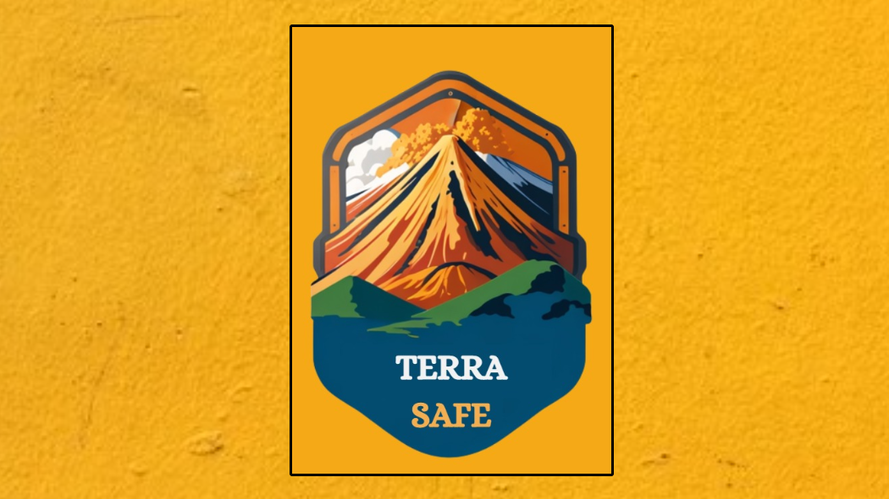
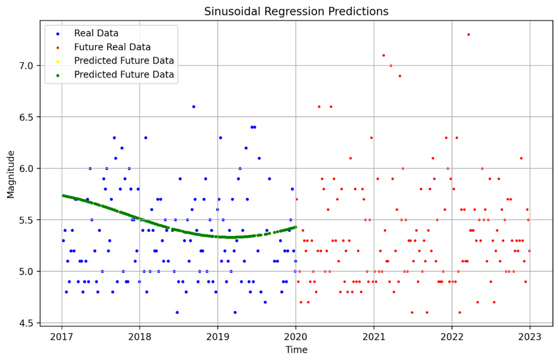
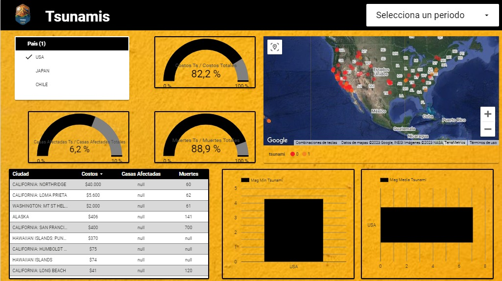

# TerraSafe 🌍🛡️

Welcome to TerraSafe, an open source data science project dedicated to safeguarding nations and organizations worldwide against the devastating impact of earthquakes! 🌏⚡🛡️

## About TerraSafe 🚀🔍

TerraSafe is a groundbreaking initiative that harnesses the power of data science to predict and mitigate earthquake damages. By blending the latest advancements in machine learning and data visualization, TerraSafe empowers governments and organizations with invaluable insights and tools to make informed decisions and protect lives and infrastructure. 📈💡💪



## Machine Learning Marvels 🎯🔮

At the heart of TerraSafe lie two remarkable machine learning systems, each designed to address specific earthquake-related challenges. Let's explore them: 🌀🛠️

### 1. Sinusoidal Regression 📈🌐

Our first wonder is the Sinusoidal Regression model! 🌐 By analyzing cyclical earthquake behavior over specific areas, this system allows governments and organizations to determine whether it's the opportune time to invest in infrastructure and early warning systems or prepare for aid and potential reconstruction. Harness the power of the sine waves to foresee the seismic future! 🌌🔮



### 2. SVM Earthquake Classifier 🌪️🏢

Behold the SVM Earthquake Classifier! This mighty machine learning system classifies current earthquakes by severity, enabling organizations to prioritize assistance and allocate resources based on the earthquake's gravity. With this tool, we navigate the seismic landscape with precision and efficiency! 🛡️🚀🔍


## Looker Dashboard - Visualizing the World 📊🌍

What's a powerful data project without a dazzling dashboard? 💻🚀 Our Looker Dashboard 📊 automagically draws insights from the extensive seismic data stored in BigQuery. With stunning visualizations, it offers a comprehensive view of earthquake damages worldwide. Visualize the world's seismic activity at your fingertips! 🗺️📈🌍


[View Dashboard here...](https://lookerstudio.google.com/reporting/560da032-b939-4b78-a596-502e8e2591e8)

## 🚀 Introducing TerraSafe Web Platform 🌐

We are thrilled to announce the launch of our TerraSafe Web Platform! 🎉

TerraSafe Web Platform is a one-stop solution that provides easy access to all the powerful tools and features of TerraSafe, our cutting-edge earthquake data science project. With just a few clicks, you can explore the fascinating world of earthquake analysis, prediction, and impact assessment.

🔍 **Explore Powerful Tools**: Dive into the world of earthquake data science with our sophisticated machine learning models and data visualizations. Get valuable insights and make informed decisions to mitigate the impact of earthquakes worldwide. 💡

🌐 **Centralized Access**: Say goodbye to the hassle of navigating through multiple applications. TerraSafe Web Platform brings everything together in one place, making it easier and more efficient to use our powerful tools. 🚀

💻 **User-Friendly Interface**: We've designed our platform with simplicity and ease of use in mind. Whether you're a data scientist, government official, or simply a curious individual, you'll find our platform intuitive and user-friendly. 🤓

[Our website](https://www.example.com)

## The Tech Stack - Your Stronghold 🔧💻🗄️

Our tech stack is the rock-solid foundation behind TerraSafe's seamless operation: 🔧💻🗄️

- Python - The magical language that powers our data analysis and machine learning algorithms! 🐍✨
- SQL - The backbone of data manipulation and storage, driving our queries and organization. 🗄️🔍
- Airflow - Our trusty orchestration tool that automates data extraction and transformation. 🌬️📊
- Git - The guardian of version control, securing our code and collaboration. 🗝️🐙
- Scikit-learn - The wizard behind our machine learning models, making predictions a breeze. 🔮🌟
- Looker - The maestro of data visualization, transforming raw data into beautiful insights. 📊🎨
- BigQuery - The mighty database where our transformed data resides, ready to be explored! 🔍💾
- GCP - Our reliable host in the cloud, ensuring our data's safety and accessibility. ☁️🚀

## Unlocking the Power! 🔓🔍💼

By harnessing the data from NOAA and USGS APIs with Airflow, we ensure an uninterrupted stream of vital information. Our backup VM stands guard, ready to support the flow whenever needed. With the transformed data stored in BigQuery, our Looker Dashboard and Streamlit platform leap into action, unlocking the true power of data science! 🔓🚀🔍

## 🚀 Getting Started with TerraSafe Project 🌍

Below are the simple steps to get the project up and running on your local machine:

1. **Clone the Repository**: Start by cloning this GitHub repository to your local machine using the following command:

```bash
git clone https://github.com/yourusername/terrasafe.git
```

2. **Navigate to Project Directory**: Change your working directory to the TerraSafe project folder:

```bash
cd terrasafe
```

3. **Create Virtual Environment (Optional)**: While not mandatory, it is highly recommended to create a virtual environment to keep your project dependencies isolated. Use the following command to create a virtual environment (you must have `virtualenv` installed):

```bash
virtualenv venv
```

Activate the virtual environment:

- For Windows:

```bash
venv\Scripts\activate
```

- For macOS and Linux:

```bash
source venv/bin/activate
```

4. **Install Dependencies**: Now, let's install the required packages from the `requirements.txt` file:

```bash
pip install -r requirements.txt
```

5. **Run TerraSafe Web Platform**: With all the dependencies installed, you can now launch the TerraSafe Web Platform using Streamlit:

```bash
streamlit run main.py
```

6. **Explore TerraSafe**: Open your web browser and navigate to `http://localhost:8501` to access TerraSafe Web Platform. Now you have full access to our powerful earthquake data science tools and analysis at your fingertips! 🌐🚀

Remember, you can always reach out to our team for any assistance or feedback. Let's work together to make the world a safer place! 💪🌟

## The Journey Awaits! 🌠🛤️🏞️

Embark on this captivating journey with TerraSafe, where data science and machine learning blend harmoniously to protect and empower. Join us in our mission to safeguard lives, infrastructure, and communities from the unpredictable forces of earthquakes! Together, we pave the way for a safer and more resilient world. 🚀💪🌠

